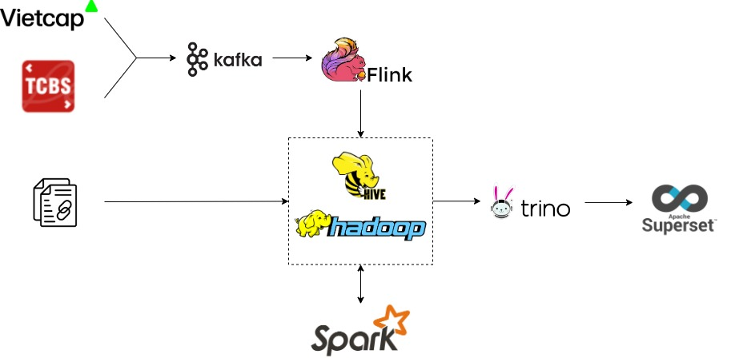
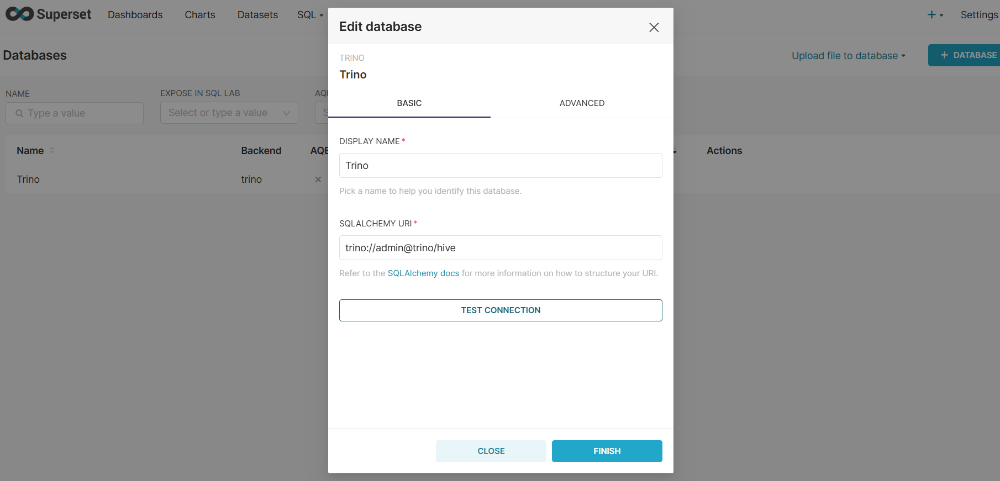
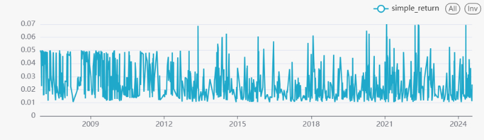

#  Bigdata Pipeline

In this repository, I deployed a simple data pipeline for processing, storing, and visualizing data. Hands-on Big Data solution with batch processing and stream processing.

## Architecture diagram



## 📖Overview

* Capture: Restful API, Flat file about stock
* Ingest: Kafka
* Store: Hadoop Hive
* Compute: Spark, Flink, Trino
* Visualize: Superset
* Workflow:: Airflow
* Container Orchestration: Docker

## 🛠️ Quick Start:

To deploy a cluster, run:
```
docker compose up
bash script/setup.sh
```

Spark calculates some returns like simple return, log return, and cumulative return.

Use Superset to visualize the report for Business Insight. Please connect to Trino with Superset:



You can now let your imagination run wild when examining and evaluating the facts. Example:




## Update:

* ~~Build batch processing~~
* Integrate Airflow
* Build stream processing


